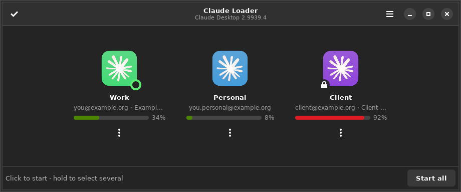
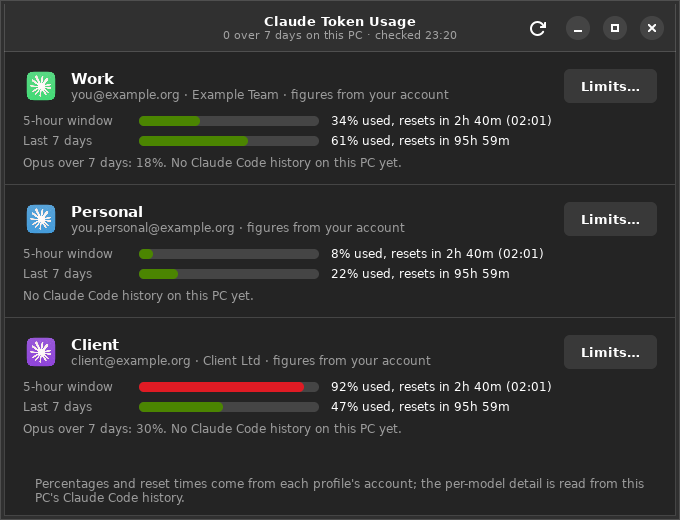
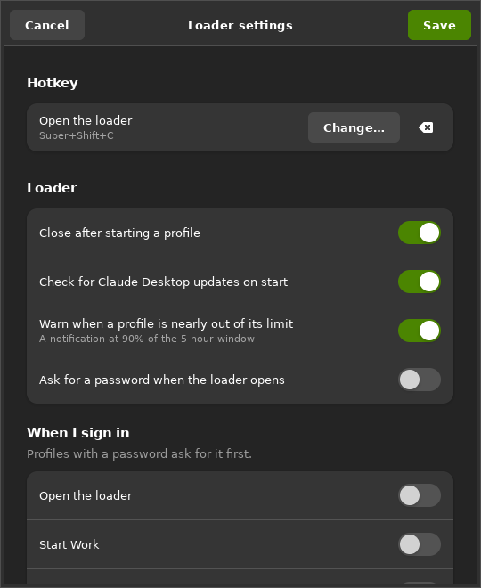
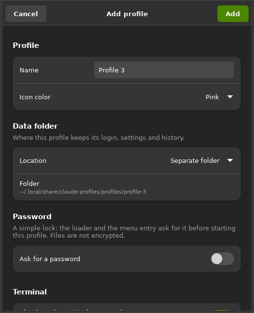

# Installing and using Claude Loader

A walk through the whole thing: what to install, what every question in the
wizard means, how to sign each profile in, and what each part of the windows
does. If you only want the short version, the [main page](../README.md) has it.

- [Before you start](#before-you-start)
- [Install on Linux](#install-on-linux)
- [Install on Windows](#install-on-windows)
- [The wizard, question by question](#the-wizard-question-by-question)
- [Signing each profile in](#signing-each-profile-in)
- [Turning on the token figures](#turning-on-the-token-figures)
- [Everyday use](#everyday-use)
- [The loader window](#the-loader-window)
- [The token usage window](#the-token-usage-window)
- [Loader settings](#loader-settings)
- [Adding a profile](#adding-a-profile)
- [Keeping things up to date](#keeping-things-up-to-date)
- [Uninstalling](#uninstalling)
- [When something does not work](#when-something-does-not-work)

---

## Before you start

Claude Loader runs several Claude accounts side by side. Each **profile** is a
complete, separate Claude: its own login, its own settings, its own history, its
own icon colour. They run at the same time and never mix.

You need:

| | Linux | Windows |
| --- | --- | --- |
| System | Ubuntu 22.04 or newer, GNOME desktop | Windows 10 or 11 |
| Rights | A normal user with `sudo` (used once, to install packages) | A normal user |
| Also | — | Python 3.10+ with Tkinter; the installer offers to fetch it |

Claude Desktop and the Claude Code CLI do **not** need to be installed first —
the wizard offers to install both.

You do not need anything from this repository afterwards: the installer copies
what it needs. But you do need the **whole** repository while installing,
because each installer combines its own folder with `cross-platform/`.

---

## Install on Linux

```bash
git clone https://github.com/nurxie/claude-loader.git
cd claude-loader
bash linux/install.sh
```

The script:

1. **Checks the packages it needs** — `python3-gi`, `gir1.2-gtk-4.0`,
   `gir1.2-adw-1` for the windows, `curl` and `gnupg` for Anthropic's
   repository key, `xdg-utils` for the `claude://` handler. Anything missing is
   installed with `apt-get`, so it asks for your password once.
2. **Copies the program** to `~/.local/share/claude-profiles/app` and creates
   the `claude-profiles` command in `~/.local/bin`.
3. **Starts the wizard** — see [below](#the-wizard-question-by-question).

If `~/.local/bin` is not on your `PATH` yet, open a new terminal (or log out and
back in) afterwards, or the `claude-*` commands will not be found.

To update later, pull the repository and run the same command again. Your
profiles and settings are kept.

---

## Install on Windows

Double-click **`windows\Install.cmd`**. It runs `install.ps1`, which:

1. **Finds Python 3.10 or newer with Tkinter.** If there is none, it offers to
   install Python 3.12 for your user with `winget`.
2. **Creates a private Python environment** in
   `%LOCALAPPDATA%\claude-profiles\venv`, so nothing is added to your system
   Python.
3. **Installs the optional `sv-ttk` theme**, which gives the loader the
   Windows 11 look. If it cannot be installed, the standard theme is used.
4. **Copies the program** to `%LOCALAPPDATA%\claude-profiles\app` and creates
   `claude-profiles.cmd` in `%LOCALAPPDATA%\claude-profiles\bin`.
5. **Starts the wizard.**

To update later, pull the repository and double-click `Install.cmd` again.

---

## The wizard, question by question

The wizard runs in the terminal. Every question has a default in brackets;
pressing Enter accepts it. Nothing is written until the summary at the end,
where you confirm.

### Step 1 — Claude Desktop

If Claude Desktop is already installed, the wizard says which version and moves
on.

If it is not:

- **On Linux** it offers to install it from Anthropic's official apt
  repository. The signing key is downloaded and its fingerprint checked against
  a known value before anything trusts it; if it does not match, the wizard
  stops.
- **On Windows** it opens the download page and waits for you to finish, then
  checks again. If you have the Microsoft Store version, it also makes a copy of
  the app in `%LOCALAPPDATA%\ClaudePortable` — Windows will not start the Store
  version with a separate data folder, so the extra profiles run from that copy.
  It is about 700 MB and takes a minute.

### Step 2 — Claude Code CLI

> **Create terminal commands for the profiles?**

Say yes and each profile gets a command like `claude-work`, which runs the
Claude Code CLI signed in to that profile's account. This is also what lets the
loader show real token figures later, so yes is the useful answer.

If the CLI is not installed, the wizard offers to run Anthropic's installer.

### Step 3 — Profiles

You are asked how many profiles you want (1 to 5), then four things for each:

| Question | What it means |
| --- | --- |
| **Name** | What you see everywhere: "Work", "Personal", a client's name. Spaces and any language are fine — the short id used for files and commands is derived from it separately (`IEP SAS` → `claude-iep-sas`). |
| **Icon color** | Original, Green, Blue, Purple, Pink, Yellow, Teal or Graphite. The icon is the installed Claude logo, recoloured on your machine. This is how you tell windows apart in the dock and taskbar. |
| **Data folder** | Where this profile keeps its login, settings and history. Three choices, explained below. |
| **Password** | Optional. A lock: the loader and the menu entry ask for it before starting this profile. |

The **data folder** choices:

- **Standard Claude folders** — the profile uses Claude's normal locations and
  therefore **keeps the login you already have**. Only one profile can do this,
  and it is usually the first one.
- **Separate folder** (the default) —
  `~/.local/share/claude-profiles/profiles/<id>` on Linux,
  `%APPDATA%\claude-profiles\profiles\<id>` on Windows.
- **A folder I choose** — anywhere you like. Useful if you keep profiles on
  another drive.

About the password: it is a **lock, not encryption**. It stops someone from
opening a profile from the loader, but the files stay ordinary files owned by
your user. Use it to keep a shared screen tidy, not to protect data.

### Step 4 — The loader

> **Install the loader?**

The loader is the window with all your profiles that opens on a hotkey. Then:

| Question | What it means |
| --- | --- |
| **Hotkey** | `Super+Shift+C` on Linux, `Win+Shift+C` on Windows by default, or one you type. Two to four keys, at least one of Ctrl, Alt, Super/Win — Shift alone would swallow ordinary typing. The wizard warns if something else already uses it. |
| **Password for the loader** | Optional, separate from the per-profile passwords. The loader opens locked and asks before showing anything. |
| **Check for Claude Desktop updates** | When the loader opens, it looks for a newer Claude and offers it in a banner. |
| **Look for new Claude Loader versions** | The same for this program. It only tells you; it never installs by itself. |
| **Tray agent** (Windows only) | A small background program that owns the hotkey and offers a quick menu near the clock. Without it there is no hotkey on Windows. |
| **Desktop shortcut for the loader** (Windows only) | Self-explanatory. |

### Step 5 — At sign-in

Two separate choices: whether the **loader** opens when you sign in to the
computer, and which **profiles** start by themselves. Profiles with a password
will ask for it right after you sign in.

### Step 6 — Sign-in links

> **Route `claude://` links to the right profile?**

"Continue with Google" comes back to Claude through a `claude://` link, and that
link normally always goes to the standard Claude window — so another profile
never receives the login. With routing on, Claude Loader takes those links: if
exactly one profile is running it goes there, otherwise a small window asks
which one.

This is **experimental**. On Windows it is off by default, because Claude
re-registers itself for `claude://` every time it starts and the tray agent has
to keep putting the router back. The reliable way on both systems is
**Paste sign-in link** in the loader's menu — or simply signing in with e-mail
and a code, which always works.

### Step 7 — Windows extras

Whether to put the profile shortcuts on the Desktop as well, and whether to add
the `bin` folder to your user `PATH` so the `claude-<name>` commands work in any
terminal.

### The summary

The wizard prints what it is about to do and asks once more. Only then does
anything get written.

---

## Signing each profile in

Every profile starts out signed out. **Use your e-mail address and the code
Claude sends you.** It always works, and it gives you the same account as
"Continue with Google".

If you prefer Google sign-in, the browser will offer to open Claude at the end.
Cancel that, copy the `claude://…` link, then in the loader choose
**☰ › Paste sign-in link**, pick the profile and click Send.

---

## Turning on the token figures

**The progress bars need one extra sign-in per profile, in the terminal.**
Signing in inside the Claude app signs *the app* in, and the app keeps that
session in its own encrypted storage, where Claude Loader cannot read it. So a
profile can be perfectly signed in and still show no percentages.

Until you do this, the profile shows its account but no bar, and
`claude-profiles usage` says so in as many words:

```
Personal (personal)  -  you@example.org, counted on this PC
    5-hour window: no open window
    Exact limits unavailable: signed in as you@example.org in the Claude app,
    which keeps its token to itself - run `claude-personal` once and sign in there.
```

### What to run

Once per profile, in any terminal:

```bash
claude-personal
```

The command is `claude-` plus the profile's short id. You never have to work it
out: it is printed in the message above, shown under the profile in the loader
before the account is known, and listed by `claude-profiles list`.

The first run has nothing to sign in with, so Claude Code starts the sign-in by
itself. If it does not, type `/login`. Use **your e-mail address and the code
Claude sends you** — the same account the profile already uses. Then `/exit`.

### Checking it worked

```bash
claude-profiles usage
```

The profile should now read **`from your account`**, with a percentage and a
reset time:

```
Personal (personal)  -  you@example.org, from your account
    5-hour window: 1% used, resets in 3h 48m (02:40)
    last 7 days:   16% used, resets in 111h 08m
```

The loader picks this up on its own within three minutes; closing and reopening
it is faster.

### Two things worth knowing

- **It does not sign you out of the app.** The terminal and the app's Code tab
  share that profile's folder, so both stay signed in to the same account.
- **A profile that has never been started has nothing to sign in yet.** Open it
  from the loader once, let it sign in, then run the command.

---

## Everyday use

| To do this | Do that |
| --- | --- |
| Open the loader | Press the hotkey, or open **Claude Loader** from the menu / Start menu |
| Start one profile | Click its card — or press its number, `1`–`5` |
| Start several | Hold the mouse button on a card, tick the others, **Start selected**. They are remembered as a group, so next time **Start \<names\>** appears |
| Start everything | **Start all** |
| Run the CLI as a profile | `claude-work` in any terminal |
| See the token figures | **☰ › Token usage…**, or `claude-profiles usage` |
| Change anything | **☰ › Settings…**, or `claude-profiles manage` in the terminal |

---

## The loader window



| What you see | What it is |
| --- | --- |
| **Claude Desktop 2.9939.4** under the title | The installed Claude version. "not installed" here means the wizard never finished. |
| **✔ button**, top left | Selection mode: click profiles to tick them instead of starting them. Holding the mouse button on a card does the same thing. |
| **☰ button**, top right | Add profile, Token usage, Paste sign-in link, check for updates, Settings, About. |
| **The icon** | The Claude logo in this profile's colour. The same icon is on its menu entry, shortcut and window, so you can tell instances apart. |
| **Green dot** on *Work* | This profile is running right now. Clicking it focuses the window instead of starting a second one. |
| **Padlock** on *Client* | This profile has a password and will ask before it starts. |
| **The line under the name** | The account this profile is signed in as. Before the profile has ever been opened it shows its terminal command instead. |
| **The bar and the percentage** | How much of that account's five-hour window is gone. Green, amber from 75 %, red from 90 % — *Client* at 92 % is nearly out. It only appears once the figures are known (see [above](#turning-on-the-token-figures)); hover it for the reset time. |
| **⋮ under the card** | Start, Edit…, Remove… for that one profile. Right-clicking the card does the same. |
| **The bottom bar** | The hint, and the start buttons: **Start all**, **Start \<group\>** if you have started some together before, **Start selected** in selection mode. |

Keys: `1`–`5` start a profile, `Ctrl+A` selects all, `Esc` leaves selection mode
or closes the window.

---

## The token usage window

Open it with **☰ › Token usage…**, from the menu entry **Claude Token Usage**,
or with `claude-profiles usage`. It is meant to be left open next to your work
and refreshes itself every minute.



| What you see | What it is |
| --- | --- |
| **The line under each name** | The account, then which models this PC's history says the tokens went to, then where the figures come from. |
| **5-hour window** | How much of the current window is gone, and when it empties — as a countdown and a wall-clock time. Claude's allowance runs in five-hour windows that open with your first message. |
| **Last 7 days** | The weekly limit, where your plan has one. Plans without one say so. |
| **Opus over 7 days** | The separate Opus allowance, when the account reports one. |
| **Limits…** | A fallback: a token budget per profile that the bars run against **only** when your account cannot be reached. You normally never need it. |
| **The footer** | A reminder of which half comes from where. |

Two things this cannot show, because nothing records them where we can read
them: chat in the Claude app (only Claude Code's own use is logged), and
anything at all for a profile whose terminal command has never been signed in.

---

## Loader settings

**☰ › Settings…**



| Setting | What it does |
| --- | --- |
| **Open the loader** (Hotkey) | The shortcut. **Change…** records the next combination you press; the ⌫ button removes it. |
| **Close after starting a profile** | The loader gets out of the way once a profile is on its way. Turn it off if you usually start several one after another. |
| **Check for Claude Desktop updates on start** | Look for a newer Claude each time the loader opens, and offer it in a banner. |
| **Warn when a profile is nearly out of its limit** | One notification per profile per window, at 90 %. |
| **Ask for a password when the loader opens** | A lock on the loader itself, separate from the per-profile ones. |
| **When I sign in** | Whether the loader opens, and which profiles start, when you sign in to the computer. |
| **Sign-in links** | The `claude://` routing described [above](#step-6--sign-in-links). |
| **Maintenance** | **Repair** recreates the menu entries, icons and commands — useful if you deleted one by accident or Claude changed its icon. **Uninstall…** opens a terminal with the uninstaller. |

---

## Adding a profile

**☰ › Add profile…**, or `claude-profiles manage` → *Add a profile*.



The same four things the wizard asks, with one difference: the **data folder**
cannot be changed later. An existing profile's folder is shown but greyed out —
to move a profile you make a new one. Everything else (name, colour, password,
terminal command) can be edited whenever you like.

---

## Keeping things up to date

| What | How |
| --- | --- |
| **Claude Desktop** | The loader's banner, `claude-profiles update`, or your normal system update. All profiles use the same installed app, so one update covers them all — restart any open Claude windows afterwards. On Windows with the Store version, "Refresh copy" re-mirrors the app for the profiles. |
| **Claude Code CLI** | Updates itself. |
| **Claude Loader** | The loader says when a new release is out and installs it on one click, or run `claude-profiles self-update` (`--check` only looks). Your profiles, settings and logins are untouched, and the old version is put back if the swap fails. |

Running the repository installer again also works, and is the way to go when the
installer itself changed.

---

## Uninstalling

```bash
claude-profiles uninstall
```

It removes the menu entries and shortcuts, the loader, the hotkey, the icons,
the `claude-*` commands and the program itself, and puts the previous
`claude://` handler back.

It then asks **separately** whether to delete the profile data folders — the
logins, settings and history of those accounts. That answer needs you to type
`DELETE`, because it cannot be undone. Claude's standard folders are never
touched, and Claude Desktop itself is only removed if you say so.

---

## When something does not work

Start here:

```bash
claude-profiles doctor
```

It prints what was detected: the Claude version and where it is, the icon it
takes colours from, the session type, the `claude://` handler, the toolkit
versions, and every profile with its folder and whether it is running.

| Symptom | Likely cause |
| --- | --- |
| The hotkey does nothing (Linux) | Not a GNOME session, or another shortcut owns the combination. Settings → Keyboard → Custom Shortcuts will show it. |
| The hotkey does nothing (Windows) | The tray agent is off or not running — check Settings, and the icon near the clock. |
| `claude-work: command not found` | `~/.local/bin` (or the Windows `bin` folder) is not on your `PATH` yet. Open a new terminal. |
| A profile shows no percentages | Its terminal command has never been signed in — see [above](#turning-on-the-token-figures). The window says which command to run. |
| A profile shows no account either | It has never been opened. Start it once. |
| Icons are plain coloured discs | The Claude icon could not be read. Settings → **Repair** after Claude is properly installed. |
| A window will not start | `<data folder>/logs/<id>.log` has whatever Claude printed. |

Anything else, including what each part of the program does and why, is in
[ARCHITECTURE.md](ARCHITECTURE.md).
